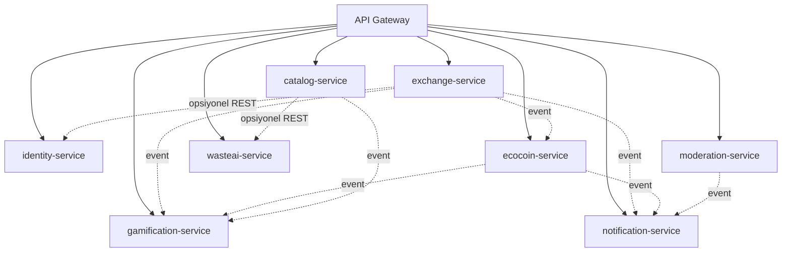

# Mikroservis Yapısı ve Servis Sınırları

Uygulama **Çoklu Mikroservis Mimarisi (Multi-Microservice Architecture)** ile tasarlanmıştır. Her mikroservis `com.yeniden.<servis>` paketi altında bağımsız bir Maven modülü ve Spring Boot uygulaması olarak yaşar:

```
com.yeniden.gateway    (api-gateway       - Port 8080)
com.yeniden.identity   (identity-service  - Port 8081)
com.yeniden.catalog    (catalog-service   - Port 8082)
com.yeniden.exchange   (exchange-service  - Port 8083)
com.yeniden.ecocoin    (ecocoin-service   - Port 8084)
com.yeniden.gamification(gamification-service - Port 8085)
com.yeniden.wasteai    (wasteai-service   - Port 8086)
com.yeniden.common     (yeniden-common    - Ortak Kütüphane)
```

Her mikroservis kendi katmanlı mimarisine (`domain`, `repository`, `service`, `controller`, `dto`) sahiptir. Servisler arası ortak nesneler (Event'ler, DTO'lar, Exception'lar) `yeniden-common` modülünden dahil edilir.

## Servisler Arası İletişim Mimarisi



Düz oklar senkron REST/gRPC çağrılarını, kesikli oklar asenkron Domain Event'leri gösterir. 

`gamification` ve `notification` servisleri hiçbir mikroservis tarafından senkron çağrılmaz — sadece olay (event) dinler. Böylece rozet veya bildirim mantığında bir gecikme/hata olsa dahi ana teslimat akışı kesintisiz çalışmaya devam eder.

## Çekirdek Mikroservisler

### `identity-service` (Port 8081)
Kayıt, giriş, oturum, profil, mahalle ataması, güven skoru.

- Kullanıcı doğrulama: telefon (SMS OTP) zorunlu, e-posta opsiyonel. Telefon doğrulaması sahte hesap üretimini zorlaştırır.
- Kullanıcı kayıt sırasında bir `Neighborhood`'a bağlanır (seçtiği yaklaşık konumdan türetilir). Sıralamalar bu bağa dayanır.
- **Güven skoru** (0–100, formül [`04-ecocoin-rules.md`](04-ecocoin-rules.md)'de): tamamlanan teslim sayısı, no-show oranı, şikayet sayısı ve hesap yaşından türetilen okunur değer. `exchange-service` ve `ecocoin-service` bunu risk kararlarında kullanır.

### `catalog-service` (Port 8082)
İlan yaşam döngüsü, kategori ağacı, fotoğraflar, yaklaşık konum, PostGIS yakınlık araması.

- İlan durumları: `DRAFT → PUBLISHED → RESERVED → HANDED_OVER → CLOSED`, ayrıca `EXPIRED` ve `WITHDRAWN`. Geçiş tablosu: [`02-domain-model.md`](02-domain-model.md).
- Fotoğraf yükleme presigned URL ile doğrudan object storage'a yapılır; API yalnızca anahtarı kaydeder.
- Yayın öncesi `wasteai-service`'e fotoğraf sorulur, dönen öneri kullanıcıya **tavsiye** olarak gösterilir; kullanıcı reddedebilir. AI cevabı gelmezse yayın engellenmez.
- Yakınlık araması PostGIS `ST_DWithin` ile; ilanın yaklaşık noktası kullanılır.

### `exchange-service` (Port 8083 - Eşleşme ve Teslimat)
Talep oluşturma, paylaşanın onayı/reddi, rezervasyon, 6 haneli teslimat kodu üretimi/doğrulanması, anti-fraud risk kontrolü, iptal ve no-show yönetimi.

- Bir ilan aynı anda tek bir talebe rezerve edilir. Rezervasyon `reserved_until` ile sınırlıdır (varsayılan 48 saat); süre dolarsa zamanlanmış iş rezervasyonu serbest bırakır ve ilan `PUBLISHED`'a döner.
- Rezervasyon onaylandığında 6 haneli tek kullanımlık **teslim kodu** üretilir ve **alan tarafına** gösterilir (QR olarak da). Alan bu kodu buluşmada paylaşana okutur; paylaşan kodu girerek teslimi onaylar.
- Kod tek kullanımlıktır, TTL'lidir (72 saat) ve hash'lenmiş saklanır. Yanlış giriş denemesi 5 ile sınırlıdır.
- Risk sinyali varsa (bkz. [`04-ecocoin-rules.md`](04-ecocoin-rules.md)) teslim `PENDING_REVIEW` olarak işaretlenir; `moderation-service` inceleme kuyruğuna düşer.

### `ecocoin-service` (Port 8084)
Puan defteri ve ödül harcaması.

- **Çift kayıtlı (double-entry) ledger.** Bakiye bir sütunda tutulmaz, hareketlerden türetilir. Her hareket eşleşen iki kayıt üretir (kaynak hesap borç / hedef hesap alacak).
- Sistem hesapları: `SYSTEM_MINT` (kazanımların kaynağı), `SYSTEM_HOLD` (harcama sırasında rezerve edilen puanlar), `SYSTEM_BURN` (harcamaların hedefi); ayrıca kullanıcı ve partner hesapları.
- Her yazma `idempotency_key` ister; aynı `HandoverConfirmed` event'i iki kez işlense de puan bir kez verilir.
- Harcama: rezervasyon (`HOLD`) → partner onayı (`CAPTURE`) → hata durumunda `RELEASE`. Partner API'si idempotent çağrı bekler.

### `gamification-service` (Port 8085)
Rozet, seviye, aylık görev, mahalle sıralaması. **Tamamen event tabanlı**; hiçbir modül onu senkron çağırmaz.

- Dinlediği event'ler: `ListingPublished`, `HandoverConfirmed`, `CoinsGranted`.
- Rozetler kural tabanlı tanımlanır (`ilk paylaşım`, `10 teslim`, `3 farklı kategori`, `4 hafta üst üste aktif` gibi).
- Seviye, toplam kazanılan Eco-Coin'den (harcanandan değil) türetilir — harcama seviyeyi düşürmez.
- **Sıralama okuma yolunda hesaplanmaz.** Mahalle sıralaması saatlik batch ile `LeaderboardSnapshot` tablosuna yazılır; API bu tabloyu okur.

### `notification-service` (Port 8086)
Push, SMS ve e-posta gönderimi. Event dinler, şablon uygular, sağlayıcıya gönderir.

### `moderation-service` (Port 8087)
Şikayet kaydı, uygunsuz ilan gizleme, şüpheli teslim inceleme kuyruğu, moderatör kararlarının denetim kaydı.

### `wasteai-service` (Port 8086)
Fotoğraftan atık/eşya türü tahmini, sağlamlık analizi ve "yeniden kullanılabilir mi (`REUSE`), geri mi dönüştürülmeli (`RECYCLE`)" kararı üreten yapay zeka mikroservisi.

- **SOLID & Çift Motorlu Hibrit Mimari:** `AiModelProvider` soyutlaması üzerinden marka/model bağımsız jenerik mimari (`RemoteVisionApiProvider`, `LocalVisionModelProvider`, `RuleBasedFallbackProvider`).
- **Failover Zinciri:** `WasteClassifierCompositeService` öncelik sırasına göre önce Harici Bulut API'yi (Gemini/GPT), ulaşılamazsa Yerel GPU Modelini (Ollama / Qwen2-VL), her ikisi de kapalıysa Kural Tabanlı Yedeği (`RuleBasedFallbackProvider`) çalıştırır.
- **Token Olasılığı (Logprob) Güven Skoru:** Modelin güven skoru halüsinasyon riski taşıyan serbest metin yerine karar token'ının log olasılığından matematiksel olarak ($P = e^{\text{logprob}}$) hesaplanır.
- **Otomatik Moderasyon Entegrasyonu:** Güven skoru %75 eşiğinin altında kaldığında (`confidence < 0.75`) yanıtta `requires_moderation=true` bayrağı set edilir ve ilan `moderation-service` inceleme kuyruğuna sevk edilir.

---

## Domain Event Sözleşmesi

Event'ler **transactional outbox / event broker** ile yayınlanır:

| Event | Yayınlayan | Yük | Dinleyen |
|---|---|---|---|
| `ListingPublished` | catalog-service | listingId, ownerId, categoryId, publishedAt | gamification-service |
| `RequestCreated` | exchange-service | requestId, listingId, giverId, takerId, createdAt | notification-service |
| `RequestAccepted` | exchange-service | requestId, listingId, giverId, takerId | notification-service |
| `ReservationExpired` | exchange-service | requestId, listingId, giverId, takerId, expiredAt | notification-service |
| `HandoverConfirmed` | exchange-service | handoverId, requestId, listingId, giverId, takerId, categoryId, quantityBand, confirmedAt, reviewRequired | ecocoin-service, gamification-service, notification-service |
| `CoinsGranted` | ecocoin-service | userId, amount, reason, sourceHandoverId | gamification-service, notification-service |
| `RedemptionCaptured` | ecocoin-service | userId, rewardId, amount | notification-service |
| `ListingReported` | moderation-service | listingId, reporterId, reason | notification-service |

Dinleyiciler **idempotent** olmak zorundadır. Her dinleyici işlediği `eventId`'yi kaydeder ve tekrarı yok sayar.
