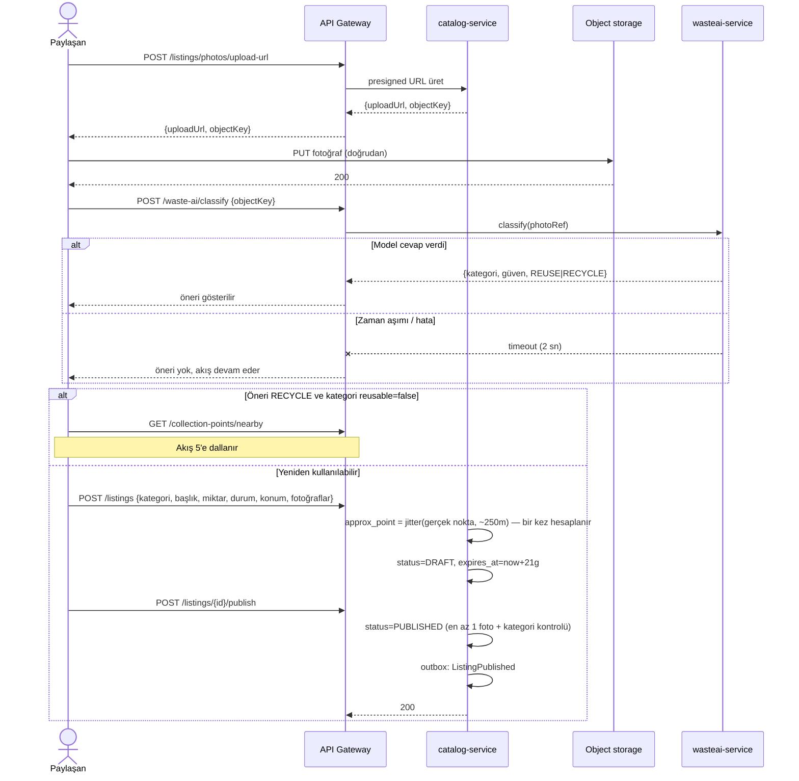
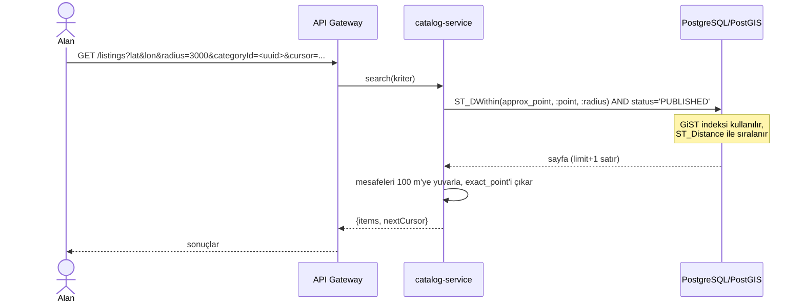
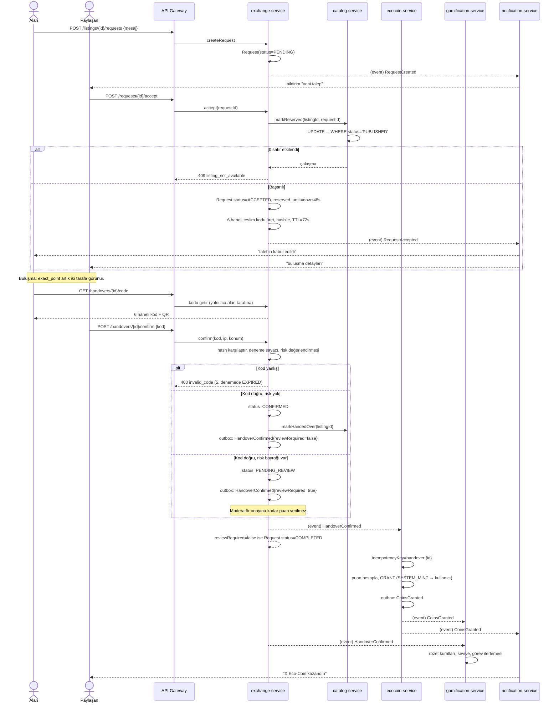
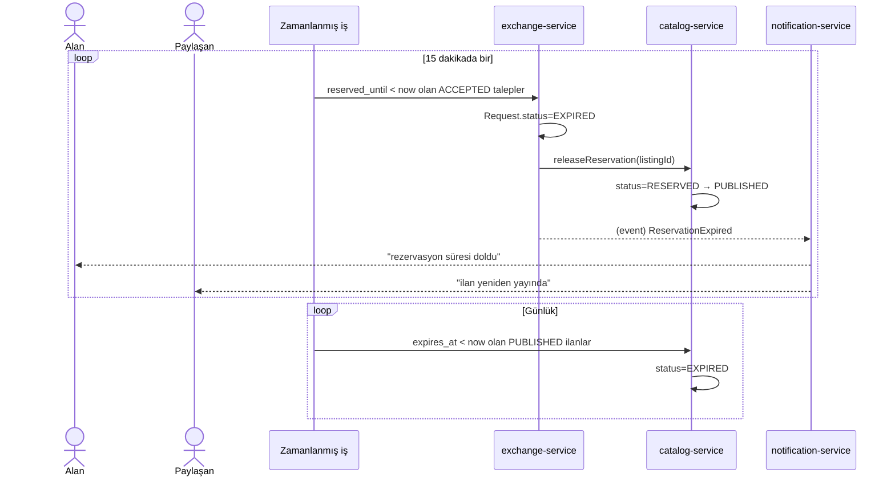
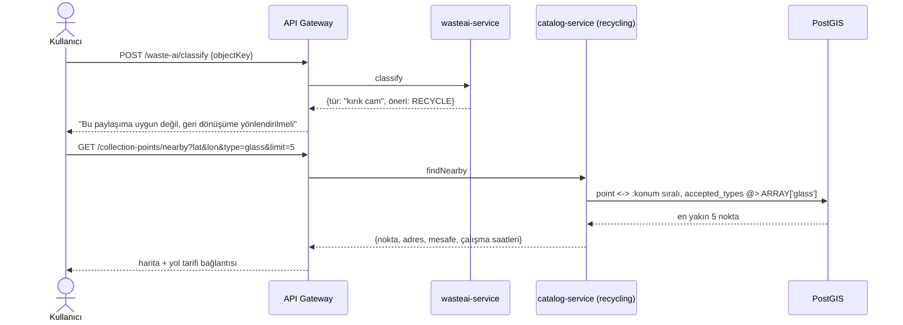
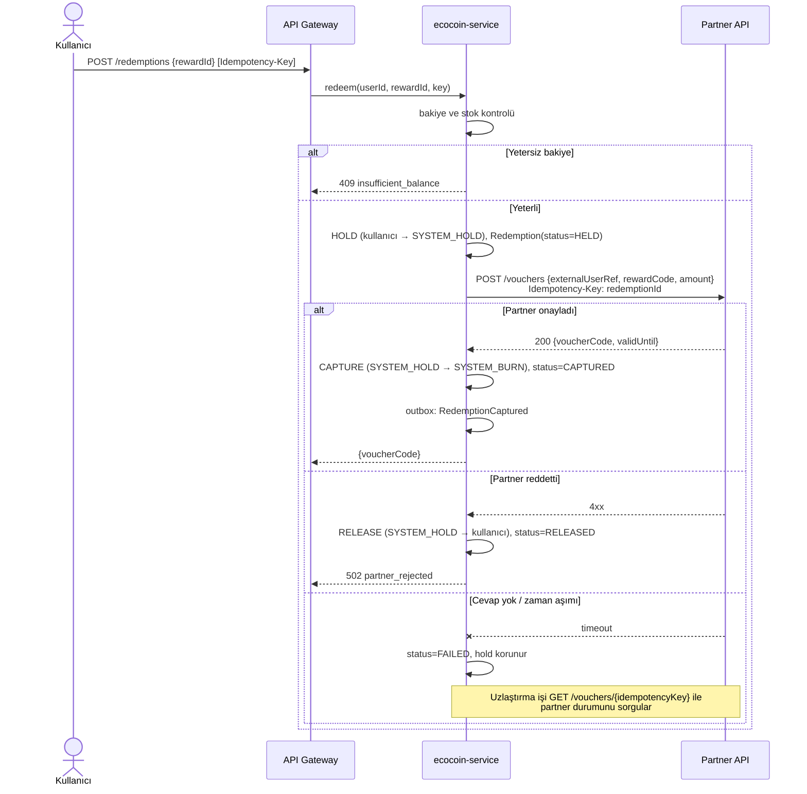

# Uçtan Uca Akışlar

Diyagramlardaki bileşen adları [`01-modules.md`](01-modules.md)'deki mikroservislerle, veri adları [`02-domain-model.md`](02-domain-model.md)'deki varlıklarla birebir aynıdır.

## 1. İlan verme

Fotoğraf API üzerinden geçmez; istemci presigned URL ile doğrudan object storage'a yükler. AI önerisi **tavsiye niteliğindedir** ve akışı bloklamaz.

Yayın anında `ListingPublished` outbox/event broker'a yazılır; `gamification-service` bunu işler.

## 2. Yakındaki ilanların aranması

Sayfalama **cursor tabanlıdır**. Yarıçap üst sınırı 25 km'dir; daha geniş sorgular reddedilir.

## 3. Talep → onay → teslim → Eco-Coin

Sistemin ana akışı.

## 4. İptal, no-show ve süre dolumu

## 5. "Paylaşıma uygun değil" → toplama noktası

Bu akış **puan üretmez.**

## 6. Eco-Coin harcaması

