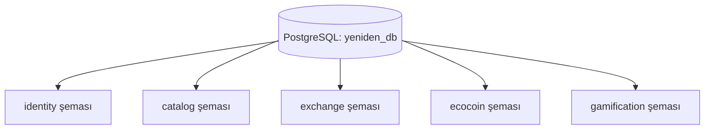

# 🗄️ YENİDEN Veritabanı Mimarisi & Şema Dokümantasyonu

Bu belge, **YENİDEN Mikroservis Platformu**'nun PostgreSQL 16 (PostGIS) ve Redis üzerindeki veritabanı mimarisini, şema izolasyonlarını, tablo yapılarını ve varlık ilişkilerini (ER Diagram) detaylandırmak amacıyla hazırlanmıştır.

---

## 📐 1. Genel Mimari Yaklaşım

Platform, **Database-per-Service** (Servis Başına Veritabanı) ilkesini **Şema Düzeyinde İzolasyon (Schema Isolation)** ile uygular:
- **Tek Veritabanı:** `yeniden_db`
- **Uzantı:** `PostGIS 3.4+` (Coğrafi sorgulamalar ve mesafe matrisleri için)
- **Şemalar:** Her mikroservisin PostgreSQL içinde kendine ait yalıtılmış bir şeması vardır. Bir servis başka bir servisin şemasına veritabanı seviyesinde erişmez (Strict Schema Isolation).



---

## 🌐 2. Mermaid Entity-Relationship (ER) Diyagramı

```mermaid
erDiagram
    users ||--o| trust_scores : "has"
    categories ||--o{ categories : "parent of"
    categories ||--o{ listings : "categorizes"
    listings ||--o{ listing_requests : "receives"
    listing_requests ||--o| handovers : "results in"
    users ||--o| wallets : "owns"
    transactions ||--o{ entries : "contains"
    users ||--o| user_levels : "has level"
    badges ||--o{ user_badges : "awarded in"

    users {
        uuid id PK
        string phone_e164 UK
        string email
        string display_name
        string status
        timestamp created_at
    }

    trust_scores {
        uuid user_id PK_FK
        int score
        int successful_handovers
        int no_shows
    }

    categories {
        uuid id PK
        uuid parent_id FK
        string name
        int eco_points_multiplier
    }

    listings {
        uuid id PK
        uuid owner_id
        uuid category_id FK
        string title
        string quantity_band
        string condition
        string status
        double approx_latitude
        double approx_longitude
    }

    listing_requests {
        uuid id PK
        uuid listing_id FK
        uuid owner_id
        uuid requester_id
        string status
    }

    handovers {
        uuid id PK
        uuid request_id FK
        uuid provider_id
        uuid receiver_id
        string confirmation_code_hash
        string status
    }

    wallets {
        uuid user_id PK
        int balance
        int daily_earned_today
        int monthly_earned_this_month
    }

    transactions {
        uuid id PK
        string idempotency_key UK
        string type
    }

    entries {
        uuid id PK
        uuid transaction_id FK
        string account
        int amount
    }

    user_levels {
        uuid user_id PK
        int level
        int total_points_earned
    }

    badges {
        uuid id PK
        string code UK
        string name
    }

    user_badges {
        uuid id PK
        uuid user_id
        string badge_code FK
    }
```

---

## 📊 3. Şemalar ve Tablo Detayları

### 3.1. `identity` Şeması (Kimlik & Kullanıcı Yönetimi)

#### Tablo: `identity.users`
Kullanıcı hesap bilgilerini tutar.
| Sütun Adı | Veri Tipi | Kısıtlar (Constraints) | Açıklama |
| :--- | :--- | :--- | :--- |
| `id` | `UUID` | **PK**, Default: `gen_random_uuid()` | Kullanıcı benzersiz kimliği |
| `phone_e164` | `VARCHAR(20)` | **UNIQUE**, NOT NULL | E.164 formatında telefon no (`+905551112233`) |
| `phone_verified_at`| `TIMESTAMP` | NULL | Telefon doğrulama zamanı |
| `email` | `VARCHAR(255)`| NULL | Kullanıcı e-posta adresi |
| `display_name` | `VARCHAR(100)`| NULL | Kullanıcı rumuzu / görünen adı |
| `status` | `VARCHAR(20)` | NOT NULL, Default: `'ACTIVE'` | Durum: `ACTIVE`, `SUSPENDED`, `DELETED` |
| `created_at` | `TIMESTAMP` | NOT NULL | Kayıt tarihi |
| `updated_at` | `TIMESTAMP` | NOT NULL | Güncellenme tarihi |

#### Tablo: `identity.trust_scores`
Kullanıcı güven puanı ve teslimat geçmişi istatistikleri.
| Sütun Adı | Veri Tipi | Kısıtlar (Constraints) | Açıklama |
| :--- | :--- | :--- | :--- |
| `user_id` | `UUID` | **PK, FK** -> `identity.users(id)` | Kullanıcı kimliği |
| `score` | `INT` | NOT NULL, Default: `50` | Güven Skoru (0 - 100 arası) |
| `successful_handovers` | `INT` | NOT NULL, Default: `0` | Başarılı teslimat sayısı |
| `no_shows` | `INT` | NOT NULL, Default: `0` | Teslimata gelmeme sayısı |
| `updated_at` | `TIMESTAMP` | NOT NULL | Son güncelleme zamanı |

---

### 3.2. `catalog` Şeması (İlan & Kategori Kataloğu)

#### Tablo: `catalog.categories`
Atık ve eşya kategori hiyerarşisi.
| Sütun Adı | Veri Tipi | Kısıtlar (Constraints) | Açıklama |
| :--- | :--- | :--- | :--- |
| `id` | `UUID` | **PK** | Kategori kimliği |
| `parent_id` | `UUID` | **FK** -> `catalog.categories(id)` | Üst kategori kimliği (Alt kategoriler için) |
| `name` | `VARCHAR(100)`| NOT NULL | Kategori adı (Örn: Mobilya, Cam) |
| `eco_points_multiplier` | `INT` | NOT NULL, Default: `10` | Kategori bazlı EcoCoin katsayısı |

#### Tablo: `catalog.listings`
Geri dönüşüm veya eşya paylaşım ilanları.
| Sütun Adı | Veri Tipi | Kısıtlar (Constraints) | Açıklama |
| :--- | :--- | :--- | :--- |
| `id` | `UUID` | **PK** | İlan kimliği |
| `owner_id` | `UUID` | NOT NULL | İlanı oluşturan kullanıcı kimliği |
| `category_id` | `UUID` | **FK** -> `catalog.categories(id)` | Kategori kimliği |
| `title` | `VARCHAR(150)`| NOT NULL | İlan başlığı |
| `description` | `VARCHAR(1000)`| NULL | İlan açıklaması |
| `quantity_band`| `VARCHAR(20)` | NOT NULL | Miktar aralığı: `SINGLE`, `FEW`, `MANY` |
| `condition` | `VARCHAR(20)` | NOT NULL | Durum: `NEW_LIKE`, `GOOD`, `USABLE` |
| `status` | `VARCHAR(20)` | NOT NULL, Default: `'DRAFT'` | `DRAFT`, `PUBLISHED`, `RESERVED`, `HANDED_OVER`, `CLOSED` |
| `approx_latitude`| `DOUBLE` | NOT NULL | Yaklaşık Enlem (Gizlilik için yuvarlanmış) |
| `approx_longitude`| `DOUBLE` | NOT NULL | Yaklaşık Boylam |
| `created_at` | `TIMESTAMP` | NOT NULL | Oluşturulma tarihi |

---

### 3.3. `exchange` Şeması (Teslimat & Takas Yönetimi)

#### Tablo: `exchange.listing_requests`
İlanlara gelen alım talepleri.
| Sütun Adı | Veri Tipi | Kısıtlar (Constraints) | Açıklama |
| :--- | :--- | :--- | :--- |
| `id` | `UUID` | **PK** | Talep kimliği |
| `listing_id` | `UUID` | NOT NULL | İlan kimliği |
| `owner_id` | `UUID` | NOT NULL | İlan sahibi kimliği |
| `requester_id` | `UUID` | NOT NULL | Talebi yapan kullanıcı kimliği |
| `status` | `VARCHAR(20)` | NOT NULL, Default: `'PENDING'` | `PENDING`, `ACCEPTED`, `REJECTED`, `CANCELLED` |

#### Tablo: `exchange.handovers`
6 Haneli SHA-256 doğrulama kodlu fiziksel teslimat kaydı.
| Sütun Adı | Veri Tipi | Kısıtlar (Constraints) | Açıklama |
| :--- | :--- | :--- | :--- |
| `id` | `UUID` | **PK** | Teslimat kimliği |
| `request_id` | `UUID` | NOT NULL | İlgili talep kimliği |
| `listing_id` | `UUID` | NOT NULL | İlan kimliği |
| `provider_id` | `UUID` | NOT NULL | Veren kullanıcı kimliği |
| `receiver_id` | `UUID` | NOT NULL | Alan kullanıcı kimliği |
| `confirmation_code_hash` | `VARCHAR(64)` | NOT NULL | 6 Haneli rastgele doğrulama kodunun SHA-256 Hash'i |
| `status` | `VARCHAR(20)` | NOT NULL, Default: `'PENDING_CODE'` | `PENDING_CODE`, `CONFIRMED`, `EXPIRED`, `FAILED` |
| `failed_attempts` | `INT` | NOT NULL, Default: `0` | Hatalı kod deneme sayısı (Max 3) |
| `confirmed_at` | `TIMESTAMP` | NULL | Kodun başarıyla doğrulandığı an |

---

### 3.4. `ecocoin` Şeması (Çift Kayıtlı Defter Cüzdan Mimarisi)

#### Tablo: `ecocoin.wallets`
| Sütun Adı | Veri Tipi | Kısıtlar (Constraints) | Açıklama |
| :--- | :--- | :--- | :--- |
| `user_id` | `UUID` | **PK** | Cüzdan sahibi kullanıcı kimliği |
| `balance` | `INT` | NOT NULL, Default: `0` | Anlık EcoCoin bakiyesi |
| `daily_earned_today`| `INT` | NOT NULL, Default: `0` | Bugün kazanılan EcoCoin (Günlük Tavan: 100) |
| `monthly_earned_this_month`| `INT` | NOT NULL, Default: `0` | Bu ay kazanılan EcoCoin |
| `last_earned_date`| `DATE` | NULL | Tavan sıfırlama takibi için son kazanılan gün |

#### Tablo: `ecocoin.transactions`
| Sütun Adı | Veri Tipi | Kısıtlar (Constraints) | Açıklama |
| :--- | :--- | :--- | :--- |
| `id` | `UUID` | **PK** | İşlem kimliği |
| `idempotency_key`| `VARCHAR(100)`| **UNIQUE**, NOT NULL | Mükerrer ödül engelleme anahtarı |
| `type` | `VARCHAR(20)` | NOT NULL | `GRANT`, `SPEND`, `REVERT` |
| `description` | `VARCHAR(255)`| NULL | İşlem açıklaması |

#### Tablo: `ecocoin.entries` (Double-Entry Ledger)
Veri tutarlılığı garantili Borç/Alacak defter girdileri.
| Sütun Adı | Veri Tipi | Kısıtlar (Constraints) | Açıklama |
| :--- | :--- | :--- | :--- |
| `id` | `UUID` | **PK** | Defter kaydı kimliği |
| `transaction_id`| `UUID` | **FK** -> `ecocoin.transactions(id)` | İşlem kimliği |
| `account` | `VARCHAR(100)`| NOT NULL | Hesap adı (Örn: `SYSTEM_MINT` veya `USER:uuid`) |
| `amount` | `INT` | NOT NULL | Tutar (Borç için negatif `-25`, Alacak için pozitif `+25`) |

---

### 3.5. `gamification` Şeması (Oyunlaştırma & Seviye)

#### Tablo: `gamification.user_levels`
| Sütun Adı | Veri Tipi | Kısıtlar (Constraints) | Açıklama |
| :--- | :--- | :--- | :--- |
| `user_id` | `UUID` | **PK** | Kullanıcı kimliği |
| `level` | `INT` | NOT NULL, Default: `1` | Kullanıcı seviyesi (`(toplam_puan / 100) + 1`) |
| `total_points_earned` | `INT` | NOT NULL, Default: `0` | Toplam kazanılan deneyim puanı (XP) |

#### Tablo: `gamification.badges` ve `user_badges`
| Tablo Adı | Anahtar | Kısıtlar | Açıklama |
| :--- | :--- | :--- | :--- |
| `badges` | `code` (VARCHAR) | **UNIQUE** | Sistemdeki rozet tanımları (Örn: `FIRST_SHARE`) |
| `user_badges` | `user_id` + `badge_code` | NOT NULL | Kullanıcının kazandığı rozetler ve zamanı |

---

## ⚡ 4. Redis Veri Yapısı (In-Memory)

OTP doğrulama işlemleri veritabanı yorulmasın diye **Redis 7** üzerinde yürütülür:

- **OTP Key:** `otp:{telefon_numarası}` (Örn: `otp:05551112233`)
- **Değer (Value):** `832866` (6 haneli sayısal şifre)
- **TTL (Time to Live):** `180 saniye` (3 Dakika)
- **Doğrulama Sonrası:** Doğrulama başarılı olduğu an Redis anahtarı silinir (One-Time Verification).
