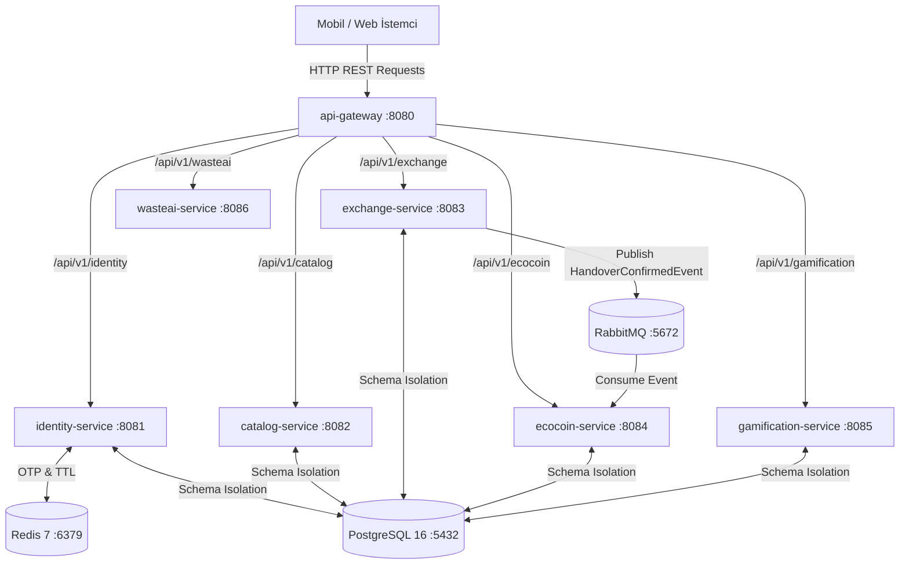

# 🚀 YENİDEN Mikroservis Mimarisi - Geliştirici & Takım Kılavuzu

Bu belge, **YENİDEN (Akıllı Sıfır Atık, Eşya Paylaşımı ve Döngüsel Ekonomi Platformu)** mimarisini ekibe dahil olan yazılımcıların hızlıca anlaması, projeyi yerel ortamlarında sorunsuz çalıştırmaları ve Yapay Zeka (AI) destekli kodlama araçlarına (Gemini, ChatGPT, Claude) başlangıç bağlamı (context) sağlayabilmesi amacıyla hazırlanmıştır.

---

## 📌 1. Proje Özeti
**YENİDEN**, şehir insanlarının evlerindeki atık veya kullanmadıkları eşyaları mahalle ölçeğinde paylaşmalarını, geri dönüşüme kazandırmalarını ve bu süreçte dijital ödüller (EcoCoin, XP, Rozetler) kazanmalarını sağlayan mikroservis tabanlı bir döngüsel ekonomi platformudur.

Platform; güvenli teslimat doğrulaması (6 haneli SHA-256 kod sistemi), çift kayıtlı defter (Double-Entry Ledger) cüzdan altyapısı, harita tabanlı konum servisleri (PostGIS) ve olay güdümlü asenkron haberleşme (RabbitMQ) özelliklerine sahiptir.

---

## 🛠️ 2. Kullanılan Teknolojiler

| Bileşen / Katman | Teknolojiler | Açıklama |
| :--- | :--- | :--- |
| **Dil & Framework** | Java 21, Spring Boot 3.3.x | Tüm backend servisleri Spring Boot tabanlıdır. |
| **API Gateway** | Spring Cloud Gateway (WebFlux / Netty) | Tüm HTTP isteklerini karşılayan ve yönlendiren giriş kapısı (Port `8080`). |
| **Veritabanı** | PostgreSQL 16 + PostGIS | Şema bazlı yalıtılmış coğrafi veritabanı (Port `5432`). |
| **Önbellek & OTP** | Redis 7 Alpine | OTP (Tek Kullanımlık Şifre) doğrulama ve TTL önbelleği (Port `6379`). |
| **Mesaj Kuyruğu** | RabbitMQ 3 Management Alpine | Olay güdümlü (Event-Driven) servisler arası asenkron haberleşme (Port `5672` / `15672`). |
| **Konteynırlaştırma** | Docker & Docker Compose | 10 adet konteynırın orkestrasyonu. |
| **Test Framework** | JUnit 5, Mockito, AssertJ | Servis katmanı için birim (unit) testleri. |

---

## 🏗️ 3. Mikroservis Mimarisi ve Servis İşlevleri

Sistem **7 ana Java mikroservisinden** ve **3 altyapı konteynırından** oluşur:



### Servislerin Sorumlulukları:
1. **`api-gateway` (Port 8080):** Dış dünyadan gelen tüm HTTP isteklerini karşılar, güvenlik/yönlendirme kurallarını uygular ve ilgili mikroservise iletir.
2. **`identity-service` (Port 8081):** Kullanıcı profilleri, telefon numarası ile kayıt/giriş, Redis tabanlı 3 dakikalık OTP şifre doğrulama ve Güven Puanı (Trust Score) hesaplaması.
3. **`catalog-service` (Port 8082):** Geri dönüşüm veya eşya paylaşım ilanlarının oluşturulması, kategorilendirilmesi ve PostGIS koordinatları ile mesafe bazlı ilan sorgulama.
4. **`exchange-service` (Port 8083):** İlan alma talepleri, 6 haneli teslimat doğrulama kodunun SHA-256 ile üretilmesi/doğrulanması ve teslimat tamamlandığında RabbitMQ'ya `HandoverConfirmedEvent` olayının fırlatılması.
5. **`ecocoin-service` (Port 8084):** Çift Kayıtlı Defter (Double-Entry Ledger: Borç/Alacak mantığı) cüzdan yönetimi. Daily Cap (Günlük 100 EcoCoin tavanı) kontrolü ve RabbitMQ dinleyicisi ile teslimat ödüllerinin otomatik yatırılması.
6. **`gamification-service` (Port 8085):** Deneyim puanı (XP) takibi, seviye atlama (`(toplam_puan / 100) + 1`) ve rozet (Badge) tanımlamaları.
7. **`wasteai-service` (Port 8086):** Atık/eşya fotoğraflarını analiz eden Yapay Zeka görüntü sınıflandırma (Stub/Mock) servisi.

---

## 🔄 4. Servisler Arası Etkileşim (Inter-Service Interaction)

Servisler iki farklı haberleşme kalıbı kullanır:

1. **Eşzamanlı HTTP/REST (Gateway Üzerinden):** İstemciler tek giriş adresi olan `http://localhost:8080` üzerinden istek atar. Gateway isteği dinamik olarak yönlendirir.
2. **Asenkron Olay Güdümlü (RabbitMQ Üzerinden):** Servislerin çökmesi veya yavaşlaması durumunda veri kaybını önlemek için asenkron haberleşme tercih edilmiştir:
   - Teslimat doğrulandığında `exchange-service` RabbitMQ'daki `yeniden.exchange` Exchange'ine `handover.confirmed` routing key'i ile bir olay yayınlar.
   - `ecocoin-service`, `ecocoin.handover.queue` kuyruğunu dinler ve teslimatı yapan kullanıcıya 25 EcoCoin ödülünü otomatik tanımlar.

---

## 🐳 5. Projeyi Çalıştırma Kılavuzu

### 5.1. Tüm Sistemi Docker Compose ile Başlatma (Tavsiye Edilen)
Projenin kök klasöründe (`backend` dizininde) terminal açarak tüm mikroservisleri ve veritabanlarını başlatabilirsiniz:

```powershell
# Proje dizinine gidin
cd backend

# Tüm 10 konteynırı derleyin ve arka planda başlatın
docker compose up --build -d

# Konteynırların durumunu kontrol edin
docker compose ps
```

### 5.2. Tek Bir Servisi Lokal / Standalone Başlatma
Geliştirme yaparken tüm servisleri docker'da çalıştırmak yerine veritabanlarını docker'da açık tutup ilgili servisi IDE veya terminal üzerinden çalıştırabilirsiniz:

1. **Önce Altyapı Konteynırlarını Başlatın:**
   ```powershell
   docker compose up -d postgres redis rabbitmq
   ```
2. **İstediğiniz Servisi Maven ile Başlatın (Örn: `identity-service`):**
   ```powershell
   .\mvnw.cmd spring-boot:run -pl identity-service
   ```
3. **Alternatif - Tek Servisi Docker Üzerinden Yeniden Başlatma:**
   ```powershell
   docker compose up --build identity-service
   ```

---

## 🧪 6. Geliştirme, SOLID Prensipleri ve Unit Test Zorunluluğu

Projemizde **KISS (Keep It Simple, Stupid)**, **SOLID Prensipleri** ve **TDD (Test-Driven Development)** ilkeleri benimsenmiştir.

> [!WARNING]
> ⚠️ **KRİTİK UYARI: SOLID PRENSİPLERİNE KESİNLİKLE UYULMALIDIR!**
> 
> Yazılan her yeni sınıf, fonksiyon ve servis mimarisi **SOLID** yazılım prensiplerine harfiyen uymak zorundadır. Spagetti kod, devasa metodlar (God Object) ve doğrudan somut sınıflara bağımlılık KESİNLİKLE YASAKTIR!
>
> 1. **S - Single Responsibility (Tek Sorumluluk):** Her sınıf/servis yalnızca tek bir iş yapmalıdır. (Controller sadece HTTP alır/döner, Service iş mantığını yürütür, Repository DB işlemlerini yapar).
> 2. **O - Open/Closed (Gelişime Açık / Değişime Kapalı):** Mevcut kodu bozmadan yeni özellik eklenebilmelidir. Interface tabanlı kodlama zorunludur (`UserService` -> `UserServiceImpl`).
> 3. **L - Liskov Substitution (Liskov İkame):** Alt sınıflar, üst sınıfların (Interface/Abstract) sözleşmesini bozmamalıdır.
> 4. **I - Interface Segregation (Arayüz Ayrımı):** İhtiyaç duyulmayan metodları içeren şişirilmiş interface'ler yerine odaklanmış spesifik interface'ler yazılmalıdır.
> 5. **D - Dependency Inversion (Bağımlılıkların Tersine Çevrilmesi):** Somut sınıflara değil, daima Interface (soyutlama) seviyesinde bağımlılık kurulmalıdır. Constructor Injection (`@RequiredArgsConstructor`) kullanılmalıdır.

> [!IMPORTANT]
> 🚨 **ALTIN KURAL: UNIT TEST ZORUNLULUĞU**
> 
> **Yeni bir iş mantığı, servis metodu veya DTO eklendiğinde/değiştirildiğinde KESİNLİKLE ilgili servisin `src/test/java/` dizini altına Unit Test yazılmalı veya mevcut testler güncellenmelidir!**

### Unit Test Çalıştırma Komutları:

```powershell
# Tüm 6 mikroservisin unit testlerini tek komutla çalıştırma:
.\mvnw.cmd test

# Sadece tek bir servisin testlerini çalıştırma (Örn: ecocoin-service):
.\mvnw.cmd test -pl ecocoin-service
```

---

## 🤖 7. AI (Yapay Zeka) İle Çalışanlar İçin Talimatlar

Bu repoda AI araçlarıyla (Gemini, ChatGPT, Claude) kod geliştirirken şu kurallara riayet edilmelidir:
- **SOLID Prensipleri:** Üretilen tüm Java kodları SOLID prensiplerine %100 uygun olmalıdır.
- **Kod Yapısı:** Paket yapıları `domain` / `dto` / `repository` / `service` / `controller` şeklinde ayrılmıştır.
- **Hata Yönetimi:** Tüm iş mantığı hatalarında `com.yeniden.common.exception.BaseException` fırlatılmalıdır.
- **DTO Dönüşümleri:** Entity nesneleri doğrudan dışarıya açılmaz; DTO nesnelerine haritalanır.
- **Test:** Üretilen her kod parçası için JUnit 5 + Mockito unit testi yazılmalıdır.
