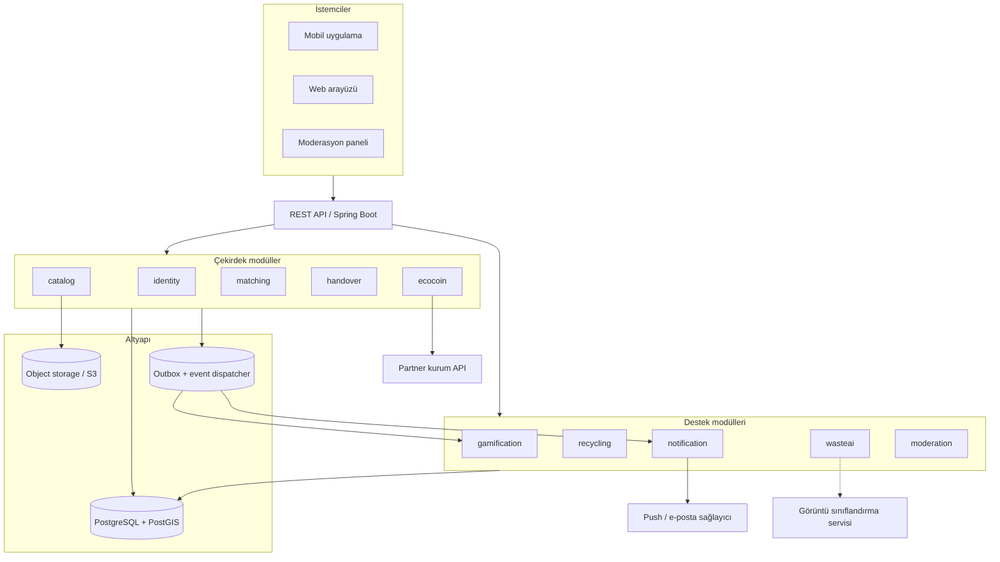

# GreenTrack — Genel Bakış

## Problem

Evlerde biriken ve hâlâ kullanılabilir durumdaki malzemeler (koli, cam kavanoz, karton, ahşap parçası, hobi malzemesi) çöpe gidiyor. Bu malzemelere ihtiyacı olan kişiler ise bunları satın almak zorunda kalıyor. Arada eşleştirme yapan, güvenilir ve teşvik edici bir kanal yok.

GreenTrack bu boşluğu doldurur: ücretsiz paylaşım ilanı → konum bazlı eşleşme → doğrulanmış teslim → Eco-Coin ödülü. Paylaşıma uygun olmayan atıklar için kullanıcıyı en yakın toplama noktasına yönlendirir.

## Aktörler

| Aktör | Rolü |
|---|---|
| **Paylaşan (giver)** | İlan açar, talepleri değerlendirir, teslimi onaylar |
| **Alan (taker)** | Yakınındaki ilanları arar, talep gönderir, teslim alır |
| **Partner kurum** | Belediye / sosyal tesis / kampanya sağlayıcı. Eco-Coin'in harcandığı yer |
| **Moderatör** | Şikayetleri, şüpheli işlemleri ve uygunsuz içeriği inceler |
| **Sistem** | Teslim doğrulaması, puan hesabı, rozet/seviye/görev ilerlemesi, sıralama üretimi |

## Temel değer akışı

```
İlan aç ──► Yakındakiler görür ──► Talep ──► Onay/Rezervasyon
                                                  │
                                                  ▼
                                   Teslim kodu ile çift taraflı doğrulama
                                                  │
                     ┌────────────────────────────┼────────────────────────┐
                     ▼                            ▼                        ▼
              Eco-Coin kazancı            Rozet / seviye / görev      Mahalle sıralaması
                     │
                     ▼
        Partner kurumda harcama (ulaşım bakiyesi, tesis indirimi, kampanya)
```

## Üst seviye bileşen görünümü



## Teknoloji kararları (özet)

| Alan | Karar | Gerekçe |
|---|---|---|
| Dil / çatı | Java 21 + Spring Boot 3 | Ekibin mevcut Java projesi, olgun ekosistem |
| Yapı | Modüler monolit | Tek deploy, net paket sınırları, ileride servise ayrılabilir |
| Veritabanı | PostgreSQL + PostGIS | Yakınlık sorguları ve ilişkisel bütünlük tek yerde |
| Şema yönetimi | Flyway | Sürümlü, geri izlenebilir migration |
| Medya | S3 uyumlu object storage | Fotoğraflar DB dışında, presigned URL ile doğrudan yükleme |
| Modüller arası | Domain event + outbox | Oyunlaştırma ve bildirim çekirdek akışı yavaşlatmaz |
| AI | Port + adapter, ilk sürümde stub | Model hazır olmadan mimari kilitlenmez |

Kararların uzun gerekçeleri ve reddedilen alternatifler: [`07-decisions.md`](07-decisions.md).

## Kalite hedefleri

1. **Kötüye kullanım direnci** — En büyük risk, gerçek teslimat olmadan Eco-Coin üretilmesi. Teslim doğrulaması çift taraflı, puan defteri çift kayıtlı ve idempotent; tavanlar, güven skoru ve inceleme kuyruğu mevcuttur. Detay: [`04-ecocoin-rules.md`](04-ecocoin-rules.md).
2. **Konum gizliliği** — Kullanıcının tam adresi hiçbir zaman saklanmaz ve yayınlanmaz. İlanlar yaklaşık konumla gösterilir; kesin buluşma noktası yalnızca eşleşme sonrası iki tarafa açılır.
3. **Basitlik önce** — MVP tek uygulama, tek veritabanı. Ölçek sorunu ölçülmeden dağıtık mimariye geçilmez.
4. **Ölçeklenme sırası** — Sırasıyla: okuma replikası → arama sorguları için ayrı indeks/materyalize görünüm → sıralama üretiminin batch'e alınması → yalnızca gerekirse modül çıkarma.
5. **Gözlemlenebilirlik** — Her Eco-Coin hareketi, her teslim doğrulaması ve her moderasyon kararı denetlenebilir kayıt bırakır.

## Doküman haritası

| Dosya | İçerik |
|---|---|
| [`01-modules.md`](01-modules.md) | Modül sınırları, sorumluluklar, bağımlılık yönü, domain event'ler |
| [`02-domain-model.md`](02-domain-model.md) | Varlıklar, ER diyagramı, durum makineleri, indeksler, konum gizliliği |
| [`03-flows.md`](03-flows.md) | Uçtan uca akışlar, sıra diyagramları |
| [`04-ecocoin-rules.md`](04-ecocoin-rules.md) | Kazanım formülü, ledger tasarımı, anti-fraud, harcama |
| [`05-api.md`](05-api.md) | REST sözleşmeleri, kimlik doğrulama, hata formatı |
| [`06-roadmap.md`](06-roadmap.md) | Fazlar, "biten" tanımı, metrikler |
| [`07-decisions.md`](07-decisions.md) | ADR kayıtları |
| [`08-mobile-api-endpoints.md`](08-mobile-api-endpoints.md) | Mobil ekranlar bazında backend API istekleri sözleşmesi |
