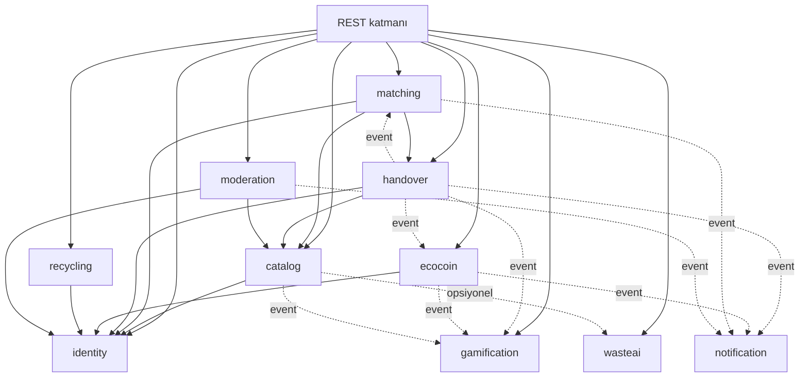

# Modül Yapısı

Uygulama tek deploy edilen bir **modüler monolit**tir. Her modül `com.greentrack.<modul>` paketi altında yaşar ve iki bölüme ayrılır:

```
com.greentrack.catalog
├── api/          # dışa açık arayüzler + DTO'lar. Diğer modüller SADECE buraya bakar
├── domain/       # entity, value object, domain servisleri
├── persistence/  # repository implementasyonları
└── web/          # REST controller
```

**Kural:** Bir modül başka bir modülün `domain`, `persistence` veya `web` paketine erişemez. Yalnızca `api` paketine erişebilir. Bu kural ArchUnit testiyle zorlanır (Faz 1'de eklenir).

## Bağımlılık yönü



Düz oklar senkron çağrıyı, kesikli oklar domain event'i gösterir. Tek istisna `catalog -.opsiyonel.-> wasteai`: bu senkron bir çağrıdır ama başarısız olması akışı kesmez.

Senkron çağrılar **yalnızca aşağı yönlüdür**; döngü yoktur. `matching`, teslim kaydını açmak için `handover`'ı çağırır; ters yön — teslim onaylandığında talebin `COMPLETED` olması — senkron çağrıyla değil, `HandoverConfirmed` event'iyle yapılır. Aksi halde iki modül birbirini çağırırdı.

`gamification` ve `notification` hiçbir modül tarafından senkron çağrılmaz — sadece event dinler. Böylece rozet mantığı bozulsa bile teslim akışı çalışmaya devam eder.

## Çekirdek modüller

### `identity`
Kayıt, giriş, oturum, profil, mahalle ataması, güven skoru.

- Kullanıcı doğrulama: telefon (SMS OTP) zorunlu, e-posta opsiyonel. Telefon doğrulaması sahte hesap üretimini pahalılaştırır.
- Kullanıcı kayıt sırasında bir `Neighborhood`'a bağlanır (seçtiği yaklaşık konumdan türetilir). Sıralamalar bu bağa dayanır.
- **Güven skoru** (0–100, formül [`04-ecocoin-rules.md`](04-ecocoin-rules.md)'de): tamamlanan teslim sayısı, no-show oranı, şikayet sayısı ve hesap yaşından türetilen okunur değer. `handover` ve `ecocoin` bunu risk kararlarında kullanır.

Dışa açtığı arayüz:
```java
public interface UserDirectory {
    Optional<UserSummary> findById(UserId id);          // id, görünen ad, mahalle, seviye
    TrustScore trustScoreOf(UserId id);
    boolean isActive(UserId id);
}
```

### `catalog`
İlan yaşam döngüsü, kategori ağacı, fotoğraflar, yaklaşık konum, yakınlık araması.

- İlan durumları: `DRAFT → PUBLISHED → RESERVED → HANDED_OVER → CLOSED`, ayrıca `EXPIRED` ve `WITHDRAWN`. Geçiş tablosu: [`02-domain-model.md`](02-domain-model.md).
- Fotoğraf yükleme presigned URL ile doğrudan object storage'a yapılır; API yalnızca anahtarı kaydeder.
- Yayın öncesi `wasteai`'a fotoğraf sorulur, dönen öneri kullanıcıya **tavsiye** olarak gösterilir; kullanıcı reddedebilir. AI cevabı gelmezse yayın engellenmez.
- Yakınlık araması PostGIS `ST_DWithin` ile; ilanın yaklaşık noktası kullanılır.

Dışa açtığı arayüz:
```java
public interface ListingCatalog {
    Optional<ListingSummary> findById(ListingId id);     // sahip, kategori, durum, konum
    void markReserved(ListingId id, RequestId by);
    void markHandedOver(ListingId id);
    void releaseReservation(ListingId id);
}
```

### `matching`
Talep oluşturma, paylaşanın onayı/reddi, rezervasyon, iptal ve no-show yönetimi.

- Bir ilan aynı anda tek bir talebe rezerve edilir. Rezervasyon `reserved_until` ile sınırlıdır (varsayılan 48 saat); süre dolarsa zamanlanmış iş rezervasyonu serbest bırakır ve ilan `PUBLISHED`'a döner.
- Talep durumları: `PENDING → ACCEPTED → COMPLETED`, ayrıca `REJECTED`, `CANCELLED`, `EXPIRED`.
- Rezervasyon çakışmasını engellemek için ilan satırı üzerinde koşullu güncelleme (`UPDATE ... WHERE status = 'PUBLISHED'`) kullanılır; iyimser kilit yeterlidir.

### `handover`
Teslimin gerçekten olduğunun doğrulanması. Sistemin güven merkezi burasıdır.

- Rezervasyon onaylandığında 6 haneli tek kullanımlık **teslim kodu** üretilir ve **alan tarafına** gösterilir (QR olarak da). Alan bu kodu buluşmada paylaşana okutur; paylaşan kodu girerek teslimi onaylar.
- Kod tek kullanımlıktır, TTL'lidir (72 saat) ve hash'lenmiş saklanır. Yanlış giriş denemesi 5 ile sınırlıdır.
- Kod doğrulandığında `HandoverConfirmed` event'i yayınlanır. Puanı `handover` vermez — sadece olguyu bildirir. Puan kuralı `ecocoin` modülünün işidir.
- Risk sinyali varsa (bkz. [`04-ecocoin-rules.md`](04-ecocoin-rules.md)) teslim `PENDING_REVIEW` olarak işaretlenir; event yine yayınlanır ama `reviewRequired` bayrağıyla. Bu bayrak geldiğinde `ecocoin` puanı beklemeye alır, `matching` de talebi `COMPLETED` yapmaz — her ikisi de moderatör onayını bekler.

Dışa açtığı arayüz:
```java
public interface HandoverService {
    HandoverId open(RequestId request);   // rezervasyon onaylandığında; kodu üretir
    void expire(HandoverId id);           // rezervasyon süresi dolduğunda
    void cancel(HandoverId id, CancelReason reason);
}
```
`matching` bu arayüz dışında `handover`'ın iç durumuna dokunmaz.

### `ecocoin`
Puan defteri ve ödül harcaması.

- **Çift kayıtlı (double-entry) ledger.** Bakiye bir sütunda tutulmaz, hareketlerden türetilir. Her hareket eşleşen iki kayıt üretir (kaynak hesap borç / hedef hesap alacak).
- Sistem hesapları: `SYSTEM_MINT` (kazanımların kaynağı), `SYSTEM_HOLD` (harcama sırasında rezerve edilen puanlar), `SYSTEM_BURN` (harcamaların hedefi); ayrıca kullanıcı ve partner hesapları.
- Her yazma `idempotency_key` ister; aynı `HandoverConfirmed` iki kez işlense de puan bir kez verilir.
- Harcama: rezervasyon (`HOLD`) → partner onayı (`CAPTURE`) → hata durumunda `RELEASE`. Partner API'si idempotent çağrı bekler.

Dışa açtığı arayüz:
```java
public interface CoinWallet {
    Balance balanceOf(UserId id);
    LedgerEntryId grant(UserId to, Coins amount, GrantReason reason, IdempotencyKey key);
    HoldId hold(UserId from, Coins amount, RewardId reward, IdempotencyKey key);
    void capture(HoldId hold);
    void release(HoldId hold);
}
```

## Destek modülleri

### `gamification`
Rozet, seviye, aylık görev, mahalle sıralaması. **Tamamen event tabanlı**; hiçbir modül onu senkron çağırmaz, o da hiçbir modülü senkron çağırmaz (yalnızca `identity`'den okuma yapar).

- Dinlediği event'ler: `ListingPublished`, `HandoverConfirmed`, `CoinsGranted`.
- Rozetler kural tabanlı tanımlanır (`ilk paylaşım`, `10 teslim`, `3 farklı kategori`, `4 hafta üst üste aktif` gibi); kural motoru veri odaklıdır, yeni rozet kod değişikliği gerektirmez.
- Seviye, toplam kazanılan Eco-Coin'den (harcanandan değil) türetilir — harcama seviyeyi düşürmez.
- Aylık görevler ay başında üretilir, ay sonunda kapanır.
- **Sıralama okuma yolunda hesaplanmaz.** Mahalle sıralaması saatlik batch ile `LeaderboardSnapshot` tablosuna yazılır; API bu tabloyu okur.

### `recycling`
Geri dönüşüm / toplama noktaları ve yönlendirme.

- `CollectionPoint` verisi belediye açık verisinden içe aktarılır, kabul ettiği atık türleriyle etiketlenir.
- "Bu paylaşıma uygun değil" akışında atık türüne göre filtreli en yakın nokta listesi döner (PostGIS mesafe sıralaması).

### `wasteai`
Fotoğraftan atık türü tahmini ve "yeniden kullanılabilir mi, geri mi dönüştürülmeli" önerisi.

Port + adapter olarak tanımlanır; MVP'de kural tabanlı bir stub (kategori seçiminden tahmin) döner, sonraki fazda gerçek model adapte edilir.

```java
public interface WasteClassifier {
    ClassificationResult classify(PhotoRef photo);  // tür, güven skoru, REUSE|RECYCLE önerisi
}
```

Çağrı **senkron ama zorunlu değildir**: zaman aşımı veya hata durumunda ilan akışı önerisiz devam eder.

### `notification`
Push ve e-posta. Event dinler, şablon uygular, sağlayıcıya gönderir. Kullanıcı bildirim tercihlerini saklar.

### `moderation`
Şikayet kaydı, uygunsuz ilan gizleme, şüpheli teslim inceleme kuyruğu, moderatör kararlarının denetim kaydı.

## Domain event sözleşmesi

Event'ler **transactional outbox** ile yayınlanır: iş verisi ve outbox kaydı aynı transaction'da yazılır, ayrı bir dispatcher outbox'ı okuyup dinleyicilere teslim eder. Böylece "puan verildi ama rozet işlenmedi" tutarsızlığı kalıcı olmaz.

| Event | Yayınlayan | Yük | Dinleyen |
|---|---|---|---|
| `ListingPublished` | catalog | listingId, ownerId, categoryId, publishedAt | gamification |
| `RequestCreated` | matching | requestId, listingId, giverId, takerId, createdAt | notification |
| `RequestAccepted` | matching | requestId, listingId, giverId, takerId | notification |
| `ReservationExpired` | matching | requestId, listingId, giverId, takerId, expiredAt | notification |
| `HandoverConfirmed` | handover | handoverId, requestId, listingId, giverId, takerId, categoryId, quantityBand, confirmedAt, reviewRequired | matching, ecocoin, gamification, notification |
| `CoinsGranted` | ecocoin | userId, amount, reason, sourceHandoverId | gamification, notification |
| `RedemptionCaptured` | ecocoin | userId, rewardId, amount | notification |
| `ListingReported` | moderation | listingId, reporterId, reason | notification |

Dinleyiciler **idempotent** olmak zorundadır; dispatcher en-az-bir-kez teslim garantisi verir. Her dinleyici işlediği `eventId`'yi kaydeder ve tekrarı yok sayar.
