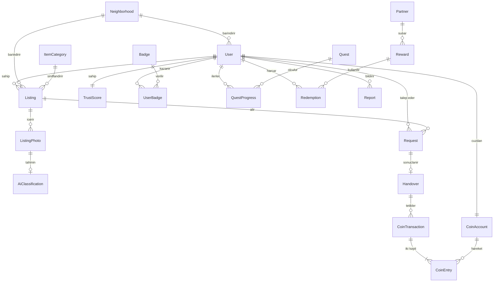

# Alan Modeli

Tüm veri tek bir PostgreSQL veritabanında tutulur; şemalar modül sınırlarını yansıtır (`identity`, `catalog`, `matching`, `handover`, `ecocoin`, `gamification`, `recycling`, `notification`, `moderation`).

**Kural:** Şemalar arası yabancı anahtar kullanılmaz. İlişki id ile kurulur, bütünlük uygulama katmanında korunur. Şema içinde yabancı anahtar serbesttir. Bu kural, ileride bir modülü ayrı servise çıkarmayı ucuzlatır ve modül sınırlarının veritabanı seviyesinde sessizce delinmesini engeller.

## Varlıklar

### identity

**User** — `id (uuid)`, `phone_e164 (unique)`, `phone_verified_at`, `email`, `display_name`, `avatar_key`, `neighborhood_id`, `home_point (geography POINT)`, `status (ACTIVE|SUSPENDED|DELETED)`, `created_at`
- `home_point` kullanıcının verdiği **yaklaşık** konumdur; açık adres alanı yoktur.

**Neighborhood** — `id`, `name`, `district`, `city`, `boundary (geography POLYGON)`, `centroid (geography POINT)`

**TrustScore** — `user_id (pk)`, `score (0..100)`, `completed_handovers`, `no_show_count`, `report_count`, `updated_at`
- Türetilmiş değerdir; olay geçmişinden yeniden hesaplanabilir.

### catalog

**ItemCategory** — `id`, `parent_id`, `code`, `name`, `reusable (bool)`, `coin_multiplier (numeric)`, `sort_order`
- Örnek ağaç: Ambalaj → koli / karton kutu; Cam → kavanoz / şişe; Ahşap → palet / tahta parçası; Hobi → kumaş / iplik / boya.
- `reusable = false` olan kategoriler paylaşım akışına değil, toplama noktası yönlendirmesine gider.

**Listing** — `id`, `owner_id`, `category_id`, `title`, `description`, `quantity_band (SINGLE|FEW|MANY)`, `condition (NEW_LIKE|GOOD|USABLE)`, `status`, `approx_point (geography POINT)`, `neighborhood_id`, `exact_point (geography POINT, null)`, `published_at`, `expires_at`, `reserved_request_id`, `created_at`, `updated_at`
- `expires_at` varsayılanı: yayından 21 gün sonra.

**ListingPhoto** — `id`, `listing_id`, `object_key`, `width`, `height`, `position`, `ai_classification_id (null)`

**AiClassification** — `id`, `object_key`, `predicted_category_id`, `confidence`, `recommendation (REUSE|RECYCLE|UNKNOWN)`, `model_version`, `accepted_by_user (bool, null)`, `created_at`
- Tahminler ve kullanıcının kabul edip etmediği saklanır; model kalitesini ölçmek ve ileride yeniden eğitmek için gerekli.

### matching

**Request** — `id`, `listing_id`, `taker_id`, `message`, `status`, `created_at`, `decided_at`, `reserved_until`
- Aynı ilana aynı kullanıcıdan yalnızca bir açık talep olabilir (kısmi unique indeks).

### handover

**Handover** — `id`, `request_id (unique)`, `listing_id`, `giver_id`, `taker_id`, `code_hash`, `code_expires_at`, `attempt_count`, `status (PENDING|CONFIRMED|PENDING_REVIEW|EXPIRED|CANCELLED)`, `confirmed_at`, `confirmed_from_ip`, `confirm_point (geography, null)`, `risk_flags (jsonb)`
- Teslim kodu düz metin saklanmaz, yalnızca hash'i tutulur.

### ecocoin

**CoinAccount** — `id`, `owner_type (USER|SYSTEM|PARTNER)`, `owner_id`, `created_at`
- Sistem hesapları: `SYSTEM_MINT` (kazanımların kaynağı), `SYSTEM_BURN` (harcamaların hedefi), `SYSTEM_HOLD` (rezerve puanlar).

**CoinTransaction** — `id`, `type (GRANT|HOLD|CAPTURE|RELEASE|ADJUSTMENT)`, `reason`, `source_ref`, `idempotency_key (unique)`, `created_at`, `created_by`

**CoinEntry** — `id`, `transaction_id`, `account_id`, `direction (DEBIT|CREDIT)`, `amount (bigint)`, `created_at`
- Puanlar tam sayıdır, kesir yoktur.
- Bakiye = `SUM(CREDIT) − SUM(DEBIT)`. Tek bir `transaction_id` altındaki kayıtların net toplamı **sıfır** olmalıdır; bu bir DB kısıtı değil, her yazmadan sonra doğrulanan ve gece işiyle denetlenen bir değişmezdir.

**Partner** — `id`, `name`, `type (MUNICIPALITY|FACILITY|CAMPAIGN)`, `api_endpoint`, `status`

**Reward** — `id`, `partner_id`, `title`, `description`, `cost_coins`, `stock`, `valid_from`, `valid_to`, `status`

**Redemption** — `id`, `user_id`, `reward_id`, `hold_transaction_id`, `status (HELD|CAPTURED|RELEASED|FAILED)`, `partner_ref`, `voucher_code`, `voucher_valid_until`, `created_at`
- `partner_ref` partnerin kendi işlem referansı; `voucher_code` kullanıcıya gösterilen koddur. İkisi ayrı alandır çünkü partner iptal/mutabakat çağrılarında `partner_ref`'i, kullanıcı ise `voucher_code`'u kullanır.

### gamification

**Badge** — `id`, `code`, `name`, `description`, `icon_key`, `rule (jsonb)`, `active`

**UserBadge** — `(user_id, badge_id)` pk, `earned_at`

**Quest** — `id`, `period (YYYY-MM)`, `code`, `title`, `target_metric`, `target_value`, `reward_coins`

**QuestProgress** — `(user_id, quest_id)` pk, `current_value`, `completed_at`

**LeaderboardSnapshot** — `id`, `scope (NEIGHBORHOOD|DISTRICT|CITY)`, `scope_id`, `period`, `user_id`, `rank`, `score`, `generated_at`

**ProcessedEvent** — `(listener, event_id)` pk, `processed_at`
- Event dinleyicilerinin idempotentliğini sağlar. Event dinleyen her modülün kendi şemasında bir kopyası bulunur.

### recycling

**CollectionPoint** — `id`, `name`, `operator`, `point (geography POINT)`, `address_text`, `accepted_types (text[])`, `opening_hours`, `source`, `updated_at`
- Burada açık adres saklanır; bunlar kamusal noktalardır, kişisel veri değildir.

### notification

**NotificationPreference** — `user_id (pk)`, `push_enabled`, `email_enabled`, `channels (jsonb)`, `updated_at`
- `channels`, olay türü bazında açma/kapama tutar (yeni talep, talep kabulü, puan kazanımı, ödül, sistem duyurusu).

**NotificationLog** — `id`, `user_id`, `event_id`, `template_code`, `channel (PUSH|EMAIL)`, `status (SENT|FAILED)`, `sent_at`

### moderation

**Report** — `id`, `target_type (LISTING|USER|HANDOVER)`, `target_id`, `reporter_id`, `reason`, `note`, `status (OPEN|REVIEWING|RESOLVED|REJECTED)`, `resolution`, `resolved_by`, `resolved_at`

## ER diyagramı



## Durum makineleri

### Listing

| Mevcut | Olay | Yeni | Not |
|---|---|---|---|
| `DRAFT` | yayınla | `PUBLISHED` | en az 1 fotoğraf ve kategori zorunlu |
| `PUBLISHED` | talep kabul edildi | `RESERVED` | `reserved_request_id` set edilir |
| `PUBLISHED` | süre doldu | `EXPIRED` | zamanlanmış iş |
| `PUBLISHED` | sahibi geri çekti | `WITHDRAWN` | |
| `RESERVED` | teslim onaylandı | `HANDED_OVER` | |
| `RESERVED` | rezervasyon süresi doldu / iptal | `PUBLISHED` | `reserved_request_id` temizlenir |
| `HANDED_OVER` | puan ve rozetler işlendi | `CLOSED` | |

**Yarış koşulu.** İki talep aynı anda kabul edilirse ilan çift rezerve edilmemelidir. Geçiş koşullu güncellemeyle yapılır:

```sql
UPDATE catalog.listing
   SET status = 'RESERVED', reserved_request_id = :requestId, updated_at = now()
 WHERE id = :listingId AND status = 'PUBLISHED';
```

Etkilenen satır sayısı 0 ise kabul işlemi `409 listing_not_available` ile reddedilir ve transaction geri alınır. Ek kilit veya kuyruk gerekmez.

### Request

| Mevcut | Olay | Yeni |
|---|---|---|
| `PENDING` | sahibi kabul etti | `ACCEPTED` |
| `PENDING` | sahibi reddetti | `REJECTED` |
| `PENDING` | talep eden vazgeçti | `CANCELLED` |
| `PENDING` | ilan başkasına rezerve edildi | `EXPIRED` |
| `ACCEPTED` | teslim onaylandı (`reviewRequired=false`) | `COMPLETED` |
| `ACCEPTED` | rezervasyon süresi doldu | `EXPIRED` |
| `ACCEPTED` | taraflardan biri iptal etti | `CANCELLED` |

### Handover

| Mevcut | Olay | Yeni |
|---|---|---|
| `PENDING` | doğru kod girildi, risk yok | `CONFIRMED` |
| `PENDING` | doğru kod girildi, risk bayrağı var | `PENDING_REVIEW` |
| `PENDING` | kod süresi doldu veya 5 hatalı deneme | `EXPIRED` |
| `PENDING` | rezervasyon süresi doldu (`reserved_until`) | `EXPIRED` |
| `PENDING` | taraflardan biri iptal etti | `CANCELLED` |
| `PENDING_REVIEW` | moderatör onayladı | `CONFIRMED` |
| `PENDING_REVIEW` | moderatör reddetti | `CANCELLED` |

`CONFIRMED`'a her geçişte `HandoverConfirmed` yayınlanır — `PENDING_REVIEW` üzerinden gelen moderatör onayında da; bu ikinci yayında `reviewRequired=false` olur, böylece `ecocoin` puanı verir ve `matching` talebi `COMPLETED` yapar. `ecocoin` idempotency anahtarı olarak `handoverId` kullandığı için çift puan riski yoktur.

## Konum gizliliği

1. **Açık adres saklanmaz.** Kullanıcı profilinde ve ilanda serbest metin adres alanı yoktur.
2. **Yaklaşık nokta.** `approx_point`, gerçek noktadan yaklaşık 250 m'lik rastgele bir kaydırmayla üretilir. Kaydırma **ilan başına bir kez** hesaplanır ve sabit kalır. Her istekte yeniden üretilirse, aynı ilanı defalarca sorgulayan biri kaydırmaların ortalamasını alarak gerçek konumu çözebilir.
3. **Kesin nokta.** `exact_point` yalnızca `RESERVED` durumundaki ilanda, yalnızca paylaşan ve rezervasyonu alan kullanıcıya döner. Sahibi kesin nokta yerine kamusal bir buluşma noktası girebilir; arayüzde önerilen varsayılan budur.
4. **Arama sonuçları** her zaman `approx_point` üzerinden hesaplanır; dönen mesafe 100 m'ye yuvarlanır.
5. **Silme.** Hesap silindiğinde ilanlar ve konum verileri kaldırılır; ledger kayıtları mali bütünlük için kullanıcı kimliği anonimleştirilerek saklanır.

## İndeksler

| Tablo | İndeks | Amaç |
|---|---|---|
| `catalog.listing` | GiST (`approx_point`) | yakınlık araması |
| `catalog.listing` | (`status`, `published_at DESC`) | liste akışı |
| `catalog.listing` | (`neighborhood_id`, `status`) | mahalle filtresi |
| `catalog.listing` | (`owner_id`, `status`) | "ilanlarım" |
| `matching.request` | kısmi unique (`listing_id`, `taker_id`) `WHERE status='PENDING'` | çift talep engeli |
| `matching.request` | (`listing_id`, `status`) | ilanın talep listesi |
| `handover.handover` | unique (`request_id`) | talep başına tek teslim |
| `ecocoin.coin_entry` | (`account_id`, `created_at`) | bakiye ve hareket dökümü |
| `ecocoin.coin_transaction` | unique (`idempotency_key`) | çift işlem engeli |
| `gamification.leaderboard_snapshot` | (`scope`, `scope_id`, `period`, `rank`) | sıralama okuma |
| `recycling.collection_point` | GiST (`point`) | en yakın nokta |

Bakiye sorgusu hareket sayısıyla büyür. Sorun ölçüldüğünde hesap bazlı checkpoint kaydı (belirli bir ana kadarki bakiye + sonrasındaki hareketler) eklenir; MVP'de gereksizdir.
