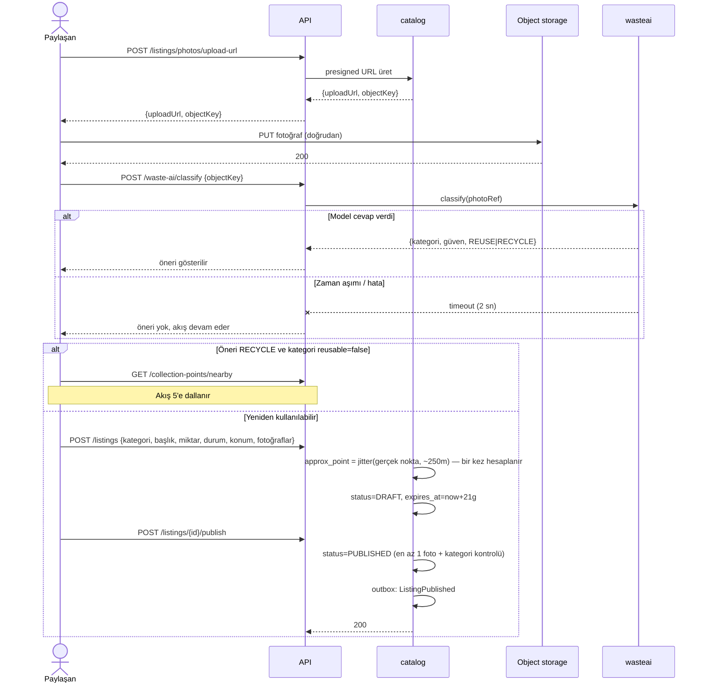
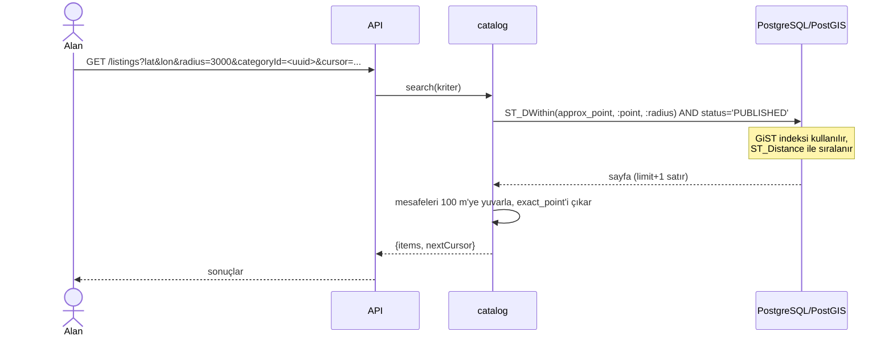
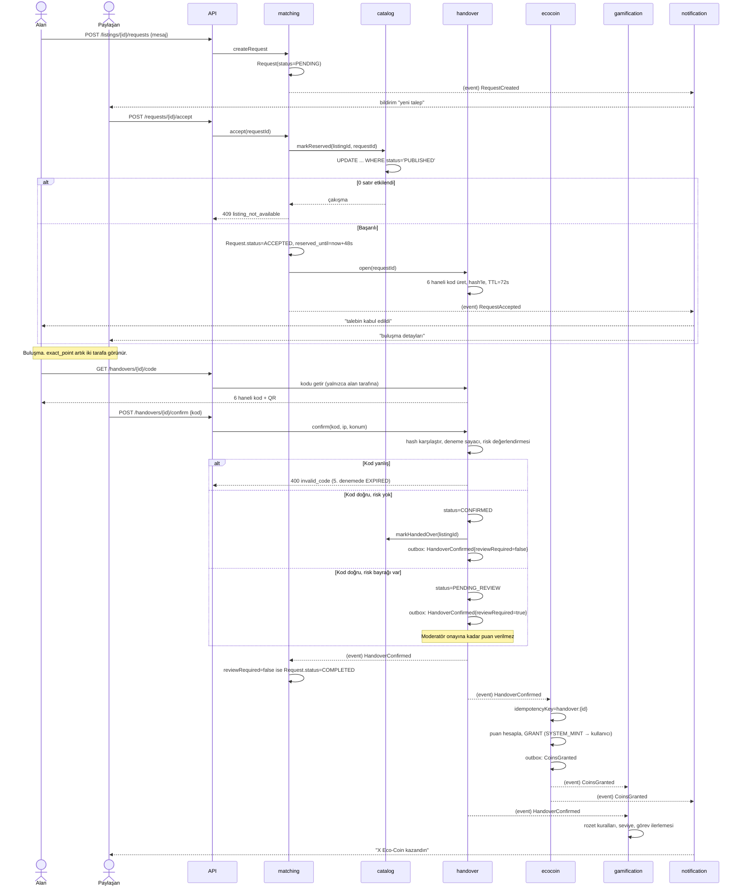
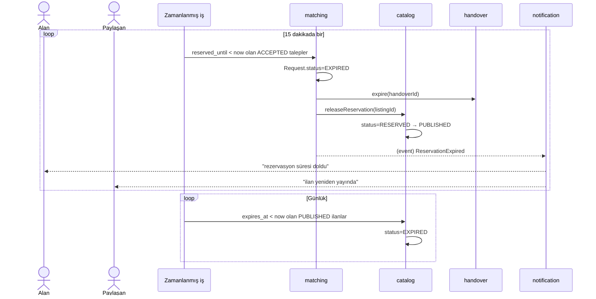
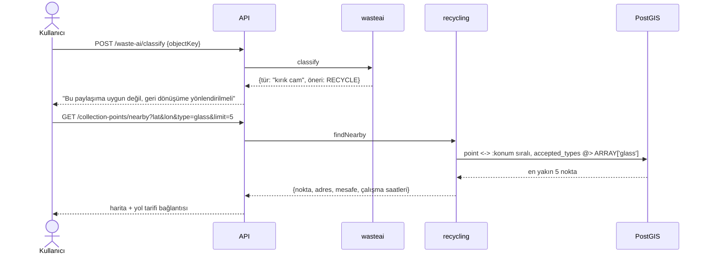
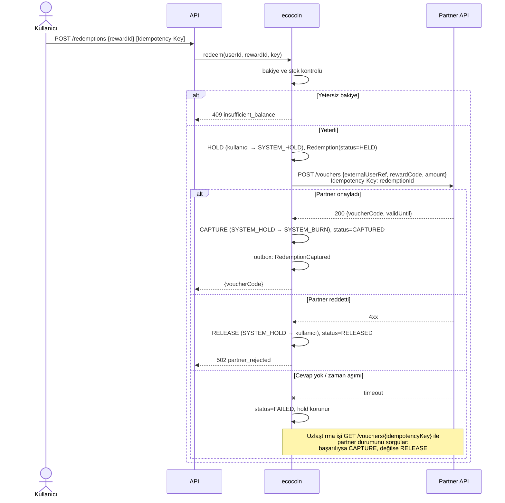

# Uçtan Uca Akışlar

Diyagramlardaki bileşen adları [`01-modules.md`](01-modules.md)'deki modüllerle, veri adları [`02-domain-model.md`](02-domain-model.md)'deki varlıklarla birebir aynıdır.

## 1. İlan verme

Fotoğraf API üzerinden geçmez; istemci presigned URL ile doğrudan object storage'a yükler. AI önerisi **tavsiye niteliğindedir** ve akışı bloklamaz.

Yayın anında `ListingPublished` outbox'a yazılır ve aynı transaction'da commit edilir; dispatcher bunu `gamification`'a taşır.

## 2. Yakındaki ilanların aranması

Sayfalama **cursor tabanlıdır**; cursor sıralama anahtarının kodlanmış halidir. Anahtar `sort` parametresine göre değişir: `distance` için `(distance, listing_id)`, `newest` için `(published_at DESC, listing_id)`. Offset kullanılmaz — akışa yeni ilan girdiğinde kayma olmaması için.

Yarıçap üst sınırı 25 km'dir; daha geniş sorgular reddedilir.

## 3. Talep → onay → teslim → Eco-Coin

Sistemin ana akışı.

Kritik noktalar:

- Kodu **alan taraf gösterir, paylaşan taraf onaylar.** Ters kurgu (paylaşanın kodu göstermesi) sahte teslimatı kolaylaştırırdı: paylaşan kendi ikinci hesabına kodu iletip tek başına döngüyü kapatabilirdi. Bu kurguda da mutlak bir engel yoktur ama en az iki cihaz ve fiziksel bir buluşma iddiası gerekir; kalan risk anti-fraud kurallarıyla yönetilir ([`04-ecocoin-rules.md`](04-ecocoin-rules.md)).
- `handover` puan miktarını **hesaplamaz**; yalnızca olguyu bildirir. Puan kuralı tek yerdedir.
- Tüm event'ler outbox üzerinden gider; dinleyiciler `ProcessedEvent` ile idempotenttir.

## 4. İptal, no-show ve süre dolumu

**No-show bildirimi.** Rezervasyon süresi dolduktan sonra taraflardan biri `POST /handovers/{id}/no-show` ile karşı tarafı bildirebilir. Bu bildirim tek başına yaptırım doğurmaz; `identity` modülünde `TrustScore.no_show_count` artırılır ve eşik aşılırsa `moderation` kuyruğuna düşer. Karşılıklı suçlamalarda otomatik karar verilmez.

Manuel iptalde (`POST /requests/{id}/cancel`) aynı serbest bırakma adımları senkron çalışır.

## 5. "Paylaşıma uygun değil" → toplama noktası

Bu akış **puan üretmez.** Toplama noktasına gidildiği sistem tarafından doğrulanamaz; doğrulanamayan bir davranışa puan vermek Eco-Coin'in değerini bozar. İleride belediye tarafında doğrulanabilir bir bırakma kanıtı (kart okutma, terazi kaydı) olursa ayrı bir kazanım kuralı eklenir.

Kullanıcı AI kullanmadan doğrudan kategori seçerek de bu akışa girebilir.

## 6. Eco-Coin harcaması

İki tarafın da hata verebildiği bir akış; para benzeri bir kaynak söz konusu olduğu için `HOLD → CAPTURE → RELEASE` üç adımlıdır.

- Hold süresi **15 dakikadır.** Uzlaştırma işi bu süre içinde sonuca varamazsa hold serbest bırakılır ve kullanıcıya bildirim gider.
- `Idempotency-Key` başlığı zorunludur; aynı anahtarla tekrar eden çağrı yeni hold açmaz, mevcut `Redemption` kaydını döner.
- Partner API'sinin idempotent olması sözleşme şartıdır ([`04-ecocoin-rules.md`](04-ecocoin-rules.md), "Harcama tarafı").
